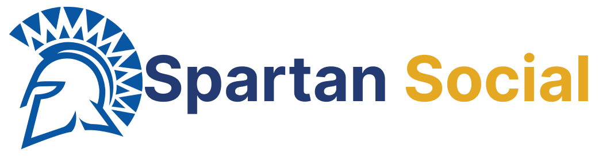

<h1 align="center">SpartanSocial API</h1>

## Purpose
This holds all of the backend code for the SpartanSocial website.

## Read first
Creating a local instance of the SpartanSocial API is not needed in order to demo the SpartanSocial website. To use SpartanSocial just clone and setup the frontend code in order to use your own local instance of SpartanSocial.

<a href="https://github.com/johnsuico/SpartanSocial-FrontEnd" target="_blank">Frontend Code</a>

Creating your own local instance of the SpartanSocial API requires you to change some code in the frontend and backend. You will also need to setup your own MongoDB Database through MongoDB Atlas.

## Local Setup
This is assuming you already have set up your MongoDB Atlas account

1. Clone the repo
2. Open the folder location in terminal
3. Install the NPM packages
```
npm install
```
4. Create a .env file to hold your MongoDB access link
5. Create the following variable inside your new .env file
```
MONGOOSE_URI = (database link)
```
6. Start the API
```
node index.js
```
  - If you have nodemon installed
  ```
  nodemon
  ```

For this to work with you local instance of SpartanSocial you need to change all of the links in the frontend code to use your localhost url to access the database. Initially the frontend code will be using the official SpartanSocial API.
